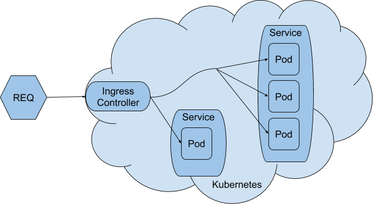

# NGINX Ingress

Setup is like picture below


We have 2 ingress resources; one for each namespace: default (=production) and staging:
- [ingress default namespace](ingress.yaml)
- [ingress staging namespace](ingress-staging.yaml)

Both ingress resources are handled by the same ingress controller and can be reached on the same external IP-address

We use the NGINX Ingress controller. Previously we used the HAProxy Ingress controller, but this one had problems with the cert-manager setup. Initially we used the builtin Google Ingress controller, but this one uses google cloud loadbalancers and was slowly responding to changes in the ingress resource manifest. Sometimes it took > 15 min before changes were processed.

Furthemore we use Cert-Manager to automatically request, install and update letsencrypt certificates. See [readme](../cert-manager/README.md)

## Install NGINX Ingress controller
See: https://kubernetes.github.io/ingress-nginx/deploy/

1. Deploy NGINX Ingress Controller
    Downloaded from: https://raw.githubusercontent.com/kubernetes/ingress-nginx/nginx-0.30.0/deploy/static/mandatory.yaml
    > `kubectl apply -f resources/ingress/nginx-ingress-controller.yaml`

1. Deploy NGINX Ingress Service
    Downloaded from: https://raw.githubusercontent.com/kubernetes/ingress-nginx/nginx-0.30.0/deploy/static/provider/cloud-generic.yaml
    Added `loadBalancerIP: "34.90.63.86" # static reserved ip address in Google External IP addresses`

    > `kubectl apply -f resources/ingress/nginx-ingress-service.yaml`

1. Verify installation
    > `kubectl get pods --all-namespaces -l app.kubernetes.io/name=ingress-nginx --watch`

## Deploy Ingress resource
1. Deploy Ingress resource
    Now adding Ingress rules to route traffic to our services
    Make sure to add an annotation that prevents multiple Ingress controllers (GCE Ingress and HAProxy Ingress) to figth for handling the ingress resource:
    ```yaml
    metadata:
      annotations:
        kubernetes.io/ingress.class: "nginx" # prevents default GCE ingress controller to handle this ingress
    ```

    > `kubectl apply -f resources/ingress/ingress.yaml`

1. Check if ingress is applied by ingress controller
    > `kubectl logs -f -n ingress-nginx nginx-ingress-controller-7fcf8df75d-g7nrr`

## Direct domain to external ip address
1. Make LoadBalancer IP address static
This can be configured under the section Google Cloud Platform > VPC network > External IP addresses

1. Configure DNS records of domain.nl (and others) to resolve to new static IP address

## Disable http trafic. Redirect to https
see https://estl.tech/configuring-https-to-a-web-service-on-google-kubernetes-engine-2d71849520d

1. Do not use the annotation `kubernetes.io/ingress.allow-http: "false"` [link](https://cloud.google.com/kubernetes-engine/docs/concepts/ingress#disabling_http) because it disallows http request (without tls) completely => bad user experience.
1. Instead add redirect to backend service, e.g. for Nginx:
    ```
    # redirect http to https based on the x_forwarded_proto header specified by the upstream proxy
    if ($http_x_forwarded_proto = "http") {
        # Use 307 (not 301) because the request method (GET/POST/DELETE,..) must not be changed by the client. 301 works with GET only.
        return 307 https://$host$request_uri;
    }
    ```